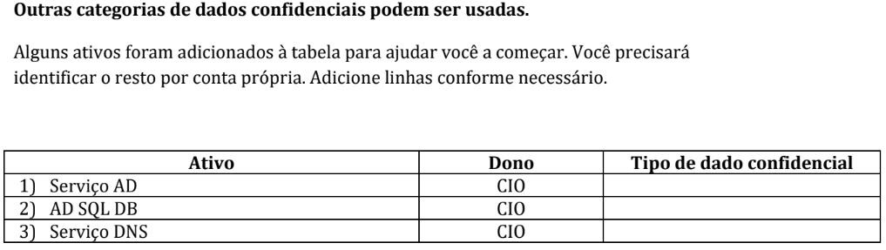

# SITUAÇÃO DA EMPRESA

=======================================================

# Negócio (Original)

- 5 Lojas regionais
- 1 Sede corporativa (Envio e Recebimento)
- 20 Frotas de Caminhões de Entrega

=======================================================

# Negócio (Passado para Pedrinho)

- Atualizar insfraestrutura de TI obsoleta
- Melhorar Segurança da Informação da sede corporativa

=======================================================
Equipe Executiva

- Pedrinho supervisiona a sede e as lojas (CEO)
- Os gerentes das lojas reportam ao COO que reporta ao Pedrinho
- Isabel supervisiona operações financeiras na sede e lojas (CFO)
- O contador senior reporta à Isabel
- Marília supervisiona operações corporativas de filiais (COO)
- Os gerentes reportam-se à Marília, assim os Gerentes de Compras, Vendas, Distribuição, RH eTI.

=======================================================

# SJSA Data Center

- Dois racks / (Nobreak) de 3000VA / 6-8 servidores montados em rack / switches para backbone Cat6 1GbE / várias prateleiras de roteadores, controladores sem fio e drives sobressalentes.

- O ambiente é climatizado independentemente e conta com um UPS próprio de 9000VA que também alimenta meia dúzia de sistemas de escritório e switches ao redor do andar em caso de falta de energia.

- Aplicações de servidor: todos os servidores são servidores montados em rack Dell PowerEdge R6xx.

=======================================================

# Backups

Semanais para um servidor baseado em nuvem

- Rack 1 copia para NAS 1.
- Rack 2 copia para NAS 2.
- NAS 1 faz backup para NAS 2 toda noite.
- NAS 2 faz backup para NAS 1 toda noite.
  (Ambiguidade de dados)

=======================================================

# Aplicações

O Software de Contabilidade (TAS):
• Livro-razão (TAS-GL).
• Contas a Pagar (TAS-AP).
• Contas a Receber (TAS-AR).
• Folha de Pagamento (Distribuições de Funcionários) (TAS-Pay).
• Bancário (TAS-Bank).
• Ativos Fixos (TAS-FA).

O Software de Distribuição (TDS):
• Inventário (TDA-Inv).
• Lista de Materiais/Kitting (TDA-BoM).
• Ordem de Compra (TDA-PO).
• Ordem de Venda (TDA-SO).
• Gestão de Armazém (TDA-WM).
• Planejamento de Requisitos (TDA-RP).

O Software ERP (TERP):
• Portais Web (site de Ecommerce) (TERP-Web).
• Gestão de Relacionamento com o Cliente (TERP-CRM).

O Sistema de Informações de Recursos Humanos (HRIS) :
• Gestão de Folha de Pagamento (exporta para Traverse para processamento de folha de pagamento) (Opt-PM).
• Recursos Humanos (Opt-HR).
• Tempo & Presença (exporta para Traverse para processamento de folha de pagamento) (Opt-Time).

NAS:
• Software de Backup e Recuperação (BARS).
• Software de Criptografia Enigmeh AES 256 para Controle de Acesso (Enig-AES).

=======================================================

# Geral

Observação: nem todas as aplicações estão necessariamente colocadas no mesmo servidor. Elas podem ser armazenadas em servidores diferentes e simplesmente configuradas para acessar umas às outras conforme necessário. Suponha que cada aplicação tenha seu próprio banco de dados.

A SJSA não possui Wi-Fi, somente rede interna Ethernet.

Atualmente, a SJSA não possui quaisquer políticas, planos ou equipe formal de segurança da informação.

# =======================================================

# =======================================================

# =======================================================

# TRABALHO

# PARTE 1 – INVENTÁRIO E PRIORIZAÇÃO DE ATIVOS DE INFORMAÇÃO

Use o documento de organização do caso para preencher as Tabelas 1 e 2 com os ativos de informação que você identificar.

=======================================================

# TABELA 1 - LISTAGEM DE ATIVOS DE INFORMAÇÃO (10 ATIVOS MINIMO)

- Proprietário dos dados: definição do proprietário dos dados.

- Tipos de dados confidenciais:

  • Confidencial do Cliente: quaisquer dados retidos pela organização que tenham sido rotulados como confidenciais. (Registros de reuniões executivas; planos de marketing e estratégicos ainda não divulgados; detalhes de comunicações e serviços fornecidos para organizações clientes selecionadas; e detalhes do programa de TI e InfoSec da empresa.)

  • Informações Eletrônicas de Saúde do Paciente: quaisquer dados retidos pela organização que contenham informações médicas pessoais, incluindo informações de funcionários e clientes. (número da conta, médico de cuidados primários, etc. A maioria dos registros de RH conteria apenas o nome da cobertura, mas não os detalhes.)

  • Informações de cartão de pagamento: quaisquer dados retidos pela organização que contenham informações de cartão de pagamento. (números de cartão de débito/crédito com datas de vencimento, nomes de usuários, códigos de segurança e/ou informações de cobrança.)

  • Informações de identificação pessoal: quaisquer dados retidos pela organização que contenham informações de identificação pessoal que possam ser usadas para identificar um indivíduo (ou roubar sua identidade). (nomes, CPF, números de carteira de motorista, endereços, números de telefone, familiares.)

  • Registros Estudantis: quaisquer dados retidos pela organização que contenham informações acadêmicas sobre um indivíduo (nomes com números de estudantes, cursos realizados, notas atribuídas, problemas de integridade acadêmica/má conduta, ajuda financeira e/ou outras PII.)

=======================================================

# TABELA 2 – RANKING PONDERADO DOS ATIVOS DE INFORMAÇÃO

- Crie uma tabela de análise (Exemplo aula 8 slide 23), para classificar todos os ativos de informação da Tabela 1.

1. Identifique no mínimo 3 critérios que você usará para avaliar os ativos identificados anteriormente e atribua pesos aos critérios.

2. Copie a lista completa de ativos da Tabela 1 na primeira coluna da Tabela 2.

3. Avalie cada ativo de informação em relação aos seus critérios, atribuindo um valor de 0 a 5 (sendo 5 o mais crítico) sob cada critério de ativo.

- “Qual a importância deste ativo em relação a este critério?”
  5 – Criticamente importante
  4 – Muito importante
  3 - Importante
  2 – Um pouco importante
  1 – Um pouco importante
  0 - Não é importante

4. Faça os cálculos para determinar os totais.

- Cada célula é multiplicada pelo peso do seu critério, então todos os produtos são somados na coluna total.

# =======================================================

# =======================================================

# PARTE 2 – AMEAÇAS AO INVENTÁRIO E PRIORIZAÇÃO DE ATIVOS DE INFORMAÇÃO

Comece inserindo na primeira coluna da Tabela 3 ameaças aos ativos de informação da organização.
